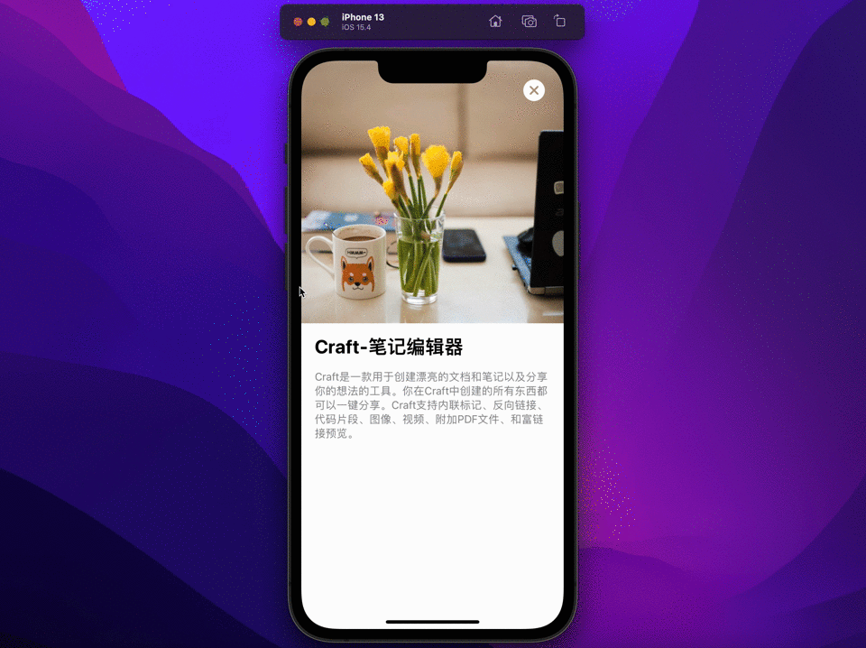

## 效果

## 目标
* 拖动手势DragGesture
* 实时获取视图位置GeometryReader
## 代码
https://github.com/yuanzj/MyAppStore-03

## 正文
### 拖动关闭
#### DragGesture
根据拖动的距离缩小视图，大于临界值立即触发关闭、小于临界值拖动结束后视图恢复原样。
```swift
/// minimumDistance：消抖处理，> 30 才触发拖动手势
DragGesture(minimumDistance: 30, coordinateSpace: .local)
	.onChanged { value in
		/// 只有从屏幕左右边缘拖动才触发关闭逻辑
		if value.startLocation.x < 100 || value.startLocation.x > UIScreen.main.bounds.width - 100 {
		
			withAnimation(.closeCard) {
				translationWidth = abs(value.translation.width)
			}
		
		}
		
		/// 大于临界值120即将触发关闭
		if translationWidth > 120 {
		
			close()
		
		}
	
	}
	.onEnded { value in
		/// 抬起手指后滑动距离大于80立即触发关闭
		if translationWidth > 80 {
		
			close()
		
		} 
		/// 抬起手指后滑动距离小于80视图恢复原样
		else {

			withAnimation(.openCard) {
				translationWidth = 0
			}
	
		}

	}

```

#### 背景设置
当我们应用一个Modifier到SwiftUI视图时Modifier的顺序很关键，在不包裹新的`ZStack`容器状态下设置背景图片只需要将背景Modifier设置在缩放之后即可代码如下：
```swift
 .scaleEffect(1 - translationWidth / 500)
 .background(.ultraThinMaterial)
```
#### 毛玻璃背景效果
在iOS15中，SwiftUI为background和样式修饰符提供了材料
```Swift
/// 半透明材质 
.background(.ultraThinMaterial)
```

#### 关闭按钮跟随淡出
```swift
closeButton
	/// 进入详情按钮淡入显示
	.opacity(show ? 1.0 : 0.0)
	/// 拖动缩小关闭时动态淡出关闭按钮，到达临界值时按钮为全透明
	.opacity((120 - translationWidth)/120.0)
```
### 顶部图片固定&放大
#### 调整视图位置抵消下拉距离
GeometryReader可以获取view的位置和大小，in：传递对应的空间坐标系名称。
```swift
/// 代码片段1
ScrollView(.vertical, showsIndicators: false) {

	cover
	content

}
/// 定义ScrollView的坐标空间名称为DetailScrollView
.coordinateSpace(name: "DetailScrollView")


/// 代码片段2
var cover: some View {

	 GeometryReader { proxy in
		 /// 获取相对于ScrollView的Y轴值
		 let scrollY = proxy.frame(in: .named("DetailScrollView")).minY
		
		 Image(appInfo.cover)
			 .resizable()
			 .aspectRatio(contentMode: .fill)
			 .matchedGeometryEffect(id: "cover\(appInfo.id)", in: namespace, isSource: true)
			  /// 放大图片； scrollY / 2.0 营造视差效果
			 .frame(width: UIScreen.main.bounds.width, height: UIScreen.main.bounds.width + (scrollY > 0 ? scrollY / 2.0 : 0))
			 /// 动态调整图片位置抵消下移距离保证图片一直固定在顶部
			 .offset(y: scrollY > 0 ? -scrollY : 0)
		
	 }

}
```

## 尾巴
1. 身份、生命周期、依赖关系